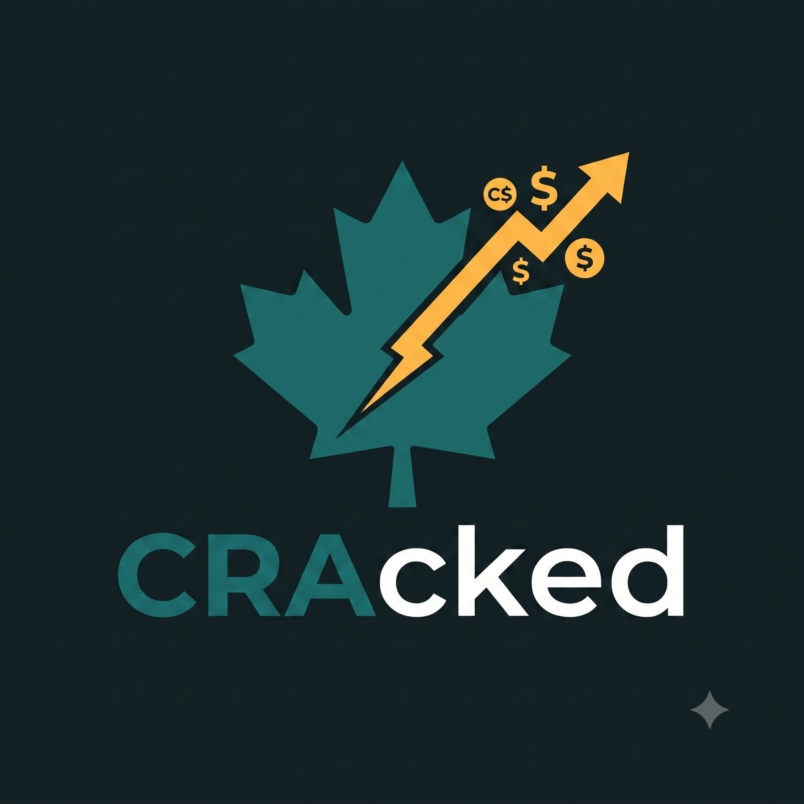

<p align="center">
  
</p>

<h1 align="center">CRAcked</h1>

<p align="center"><strong>Contribution Room, Cracked.</strong><br>
<em>Claw it back. Legally.</em></p>

---

## What is this?

**CRAcked** is a personal tracker for Canada's tax-advantaged registered
accounts — the ones with the confusing, ever-changing contribution rules that
the CRA would rather you not fully understand:

- **RRSP** — Registered Retirement Savings Plan
- **TFSA** — Tax-Free Savings Account
- **FHSA** — First Home Savings Account

Each account grows your contribution room by a different set of rules —
annual limits, carry-forwards, income-based accrual, lifetime caps, and
withdrawal quirks. Miss the details and you either leave room on the table or
get hit with an over-contribution penalty (1% per month — ouch).

CRAcked keeps a running, accurate picture of **how much room you actually
have**, **how much you've used**, and **how much tax you're clawing back**.

## Why

The CRA gives every Canadian a set of legal tools to defer or eliminate tax —
but tracking the room across three accounts, across years, is genuinely
annoying. CRAcked exists to make that dead simple, so you never:

- over-contribute and eat a penalty,
- under-use room you're legally entitled to, or
- lose track of carry-forward across years.

## The accounts, at a glance

| Account | Tax treatment | Room grows by | Key caps |
| --- | --- | --- | --- |
| **RRSP** | Tax-**deferred** (deduct now, taxed on withdrawal) | 18% of prior-year earned income + unused room | Annual dollar max; over-contribution buffer |
| **TFSA** | Tax-**free** (no deduction, tax-free growth & withdrawal) | Annual limit + unused room + withdrawals re-added next year | Cumulative lifetime room since eligibility |
| **FHSA** | Tax-**free for a first home** (deduct now, tax-free qualifying withdrawal) | Annual limit + limited carry-forward | Annual cap; lifetime cap; 15-year window |

> Exact numbers change year to year and depend on your personal history —
> CRAcked is designed to model these rules explicitly rather than hard-code a
> single year.

## Features

- [x] Track RRSP contributions per year
- [x] Compute RRSP room (18% accrual, annual dollar-limit cap, unused-room carry-forward)
- [x] Over-contribution warnings ($2,000 buffer + 1%/month penalty estimate)
- [x] Local git version history of all data + append-only Google Drive backup
- [ ] TFSA rules (cumulative room + withdrawal re-contribution timing)
- [ ] FHSA rules (annual cap, carry-forward, lifetime cap, 15-year window)
- [ ] Estimate tax refund / deferral from RRSP & FHSA deductions
- [ ] Multi-year projections

## Tech stack

- **Desktop:** [Tauri 2](https://tauri.app) — Rust backend, static HTML/CSS/JS UI
- **Rule engine:** pure Rust (`src-tauri/src/rrsp.rs`), fully unit-tested
- **Storage:** SQLite (bundled, `src-tauri/src/db.rs`) — money stored as integer cents
- **Backup:** the data directory is a git repo; `rclone copy` mirrors it
  append-only to Google Drive (see [`BACKUP.md`](BACKUP.md))

## Installing it

CRAcked ships as a **single self-contained installer per OS** — the web engine,
an embedded git, and a bundled `rclone` are all included, so there's nothing else
to install. See [`PACKAGING.md`](PACKAGING.md) for downloads and build steps.

- **Windows**: `.exe` / `.msi` — double-click.
- **macOS**: `.dmg` — drag to Applications.
- **Linux**: `.AppImage` (portable) or `.deb` (`sudo apt install ./cracked_*.deb`).

Cross-platform installers are produced by the GitHub Actions release workflow
(`.github/workflows/release.yml`) — tag a release (`git tag v0.1.0 && git push
origin v0.1.0`) and it builds all three.

### Develop with a live launcher

Install a launcher that runs the app from this repo and rebuilds on each launch,
so it always reflects your latest code — then find it via the **Super/Windows key**:

```bash
./scripts/install-desktop.sh
```

## Running from source

Prerequisites: Rust ≥ 1.77, Node, and the Tauri Linux system libraries
(WebKitGTK etc.).

```bash
cd src-tauri && cargo tauri dev     # dev run
cd src-tauri && cargo test          # tests
./scripts/fetch-rclone.sh           # grab the rclone sidecar, then:
cd src-tauri && cargo tauri build   # build an installer for this OS
```

Your data lives in `~/.local/share/CRAcked/`. To back it up to Google Drive,
follow the one-time setup in [`BACKUP.md`](BACKUP.md).

## Status

🚧 Active development. **RRSP is fully implemented** (tracking, room calculation,
over-contribution warnings) with local + Google Drive backup working. TFSA and
FHSA are next.

## Disclaimer

CRAcked is a personal tracking tool, **not** tax advice. Contribution rules
are set by the Canada Revenue Agency and change over time. Always verify your
own limits against your CRA My Account and, when in doubt, consult a tax
professional.
